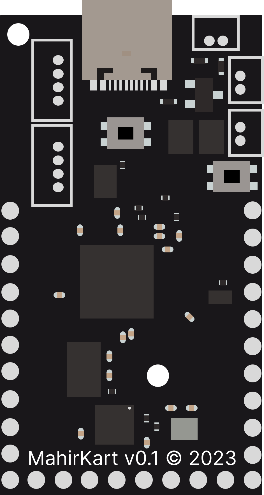

# MahirKart

<h1> MahirKart ile Aviyonik ihtiyaçlarınız tek bir noktada. </h1>

## Genel Bakış
MahirKart aviyonik geliştirme kartı, aviyonik sistemleriniz için ihtiyacınız olan herşeyi tek bir noktada toplar. Eğer aviyonik sistemleriniz için geliştirme kartı arıyorsanız MahirKart tam size göre. MahirKart ile aviyonik sistemlerinizi kolayca geliştirebilir, test edebilir ve uçuşa hazır hale getirebilirsiniz.

## MahirKart ile neler yapabilirim?
MahirKart ile yapabilecekleriniz sadece sizin hayal gücünüzle sınırlı. MahirKart ile yapabileceklerinizden bazıları şunlar:

- İnsansız hava araçları (döner kanat, sabit kanat, zeplin, vb.)
- Roket aviyonik sistemleri (kurtarma bilgisayarı, faydalı yük bilgisayarı, vb.)
- Uydu aviyonik sistemleri (faydalı yük bilgisayarı, haberleşme bilgisayarı, vb.)
- Yer istasyonu (haberleşme bilgisayarı, kontrol bilgisayarı, vb.)
- İnsansız deniz araçları (denizaltı, deniz üstü, vb.)
- Ve daha fazlası...

## Nasıl başlayabilirim?
[Hızlı Başlangıç](/quickstart/) sayfasına ilerleyerek MahirKartı nasıl kullanabileceğinizi öğrenebilirsiniz.

## MahirKart nelere sahip?
MahirKart RP2040(Arm Cortex-M0+) tabanlı bir <b>Aviyonik geliştirme kartıdır</b>. 144 MHz hızda çalışabilen çift çekirdekli işlemcisi ile yükse işlem gerektiren işlemler yapabilir, üzerindeki 2 MB harici flash bellek ile kodlarınızı ve verilerinizi kolayca depolayabilirsiniz. USB 1.1 desteği ile ara programlayıcı kullanmadan sadece bir USB-C kablo ile bilgisayarınıza bağlayarak programlayabilirsiniz. Donanımsal olarak 2 adet Uart, 2 adet I2C ve 2 adet SPI bulunmaktadır. Dahili Sensörleri ile sıcaklık, nem, basınc, 3 eksende eğim ve ivme ölçümleri yapabilirsiniz. 26 adet genel amaçlı pinden 4 adet pini analog okuma 2 adet pini de harici besleme seviyesinde motor sürme yada fünye tetikleme gibi işlemler için kullanabilirsiniz.

Daha fazla teknik bilgi için [Özellikler](/features/) bölümüne bakabilirsiniz.

## MahirKartı hangi dillerle programlayabilirim?
MahirKartı C/C++, Arduino, Rust gibi derlemeli dillere ek olarak Python ve JavaScript gibi yorumlamalı dillerle de kolaylıkla programlayabilirsiniz. 

    

