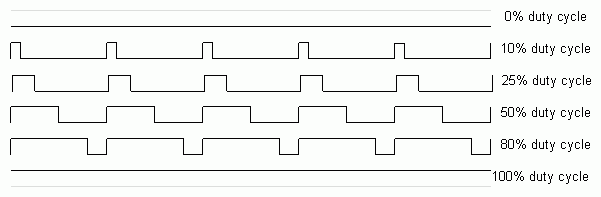

# PWM

## PWM (Pulse Width Modulation) Nedir?

PWM (Pulse Width Modulation / Darbe Genişlik Modülasyonu) geliştirme kartlarında sıklıkla kullanılan bir yöntemdir. Dijital bir pini analog çıkış olarak kullanabilmemizi sağlayan bir yöntemdir. 

Dijital bir pin sadece maximum ve minimum (mahirkart için 3.3V ve 0V) değerlerini alabilir. PWM yöntemi ile bu değerler arasında istediğimiz değerleri alabiliriz.


<!-- Resmi Tekrar oluştur -->


PWM dijital bir pini analog çıkış gibi kullanmak dışında PWM ilgisi ile çalışan bazı cihazları kontrol etmek için de kullanılır. Örneğin servo motorlar PWM ile kontrol edilebilir.

## MahirKart ile PWM

MahirKart'ın bütün dijital pinlerini PWM olarak kullanabilirsiniz. Dijital pinleri [Pinout](../../pinout.md) sayfasından öğrenebilirsiniz.

## Arduino ile PWM Kullanımı örneği


Bu örneğimizde 25. pine bağladığımız ledi PWM ile yakacağız.

```c
const int ledPin = 25;  // PWM sinyali göndermek için kullanılacak pin (örnek olarak 25 numaralı pin)

void setup() {
 
  pinMode(ledPin, OUTPUT); // PWM pini çıkış olarak ayarlanır
}

void loop() {
  // LED'i yavaşça parlaklaştırma
  for (int parlaklk = 0; parlaklk <= 255; parlaklk++) {
    analogWrite(ledPin, parlaklk);  // PWM ile parlaklık seviyesini ayarla
    delay(10);  // Kısa bir bekleme
  }

  // LED'i yavaşça karartma
  for (int parlaklk = 255; parlaklk >= 0; parlaklk--) {
    analogWrite(ledPin, parlaklk);  // PWM ile parlaklık seviyesini ayarla
    delay(10);  // Kısa bir bekleme
  }
}
```

Bu kod, 25 numaralı pin üzerine bağlı bir LED'i yavaşça parlaklaştırır ve sonra yavaşça karartır. analogWrite fonksiyonu ile PWM sinyali üretilir ve LED'in parlaklığı değiştirilir. Bu şekilde LED, yavaşça yanıp sönüyor gibi görünmelidir. Eğer LED'i farklı bir pin üzerine bağladıysanız, ledPin değişkenini bağladığınız pine göre güncelleyin.

Eğer aklınızda kalan sorular varsa [Discord](https://discord.com/invite/YVc68SrGJK) sunucumuz üzerinden sorabilirsiniz.