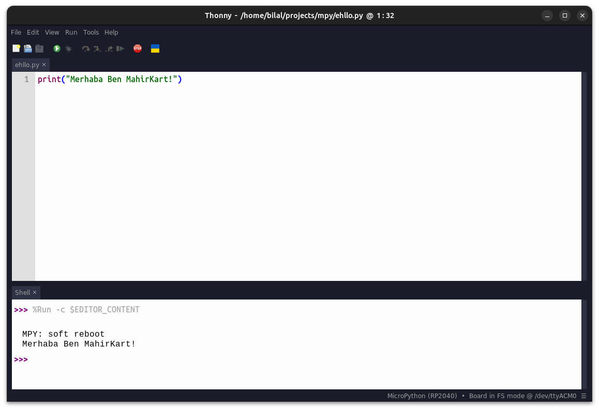

# Bilgisayar İletişimi

## Geliştirme Kartlarında Bilgisayar ile haberleşme sistemleri

Piyasada bulunan birçok geliştirme kartı bulunmakta ve bu kartlar arasında haberleşme için kullanılan yöntemler değişiklik göstermekte. Genellikle küçük boyutlu işlemcile kullanan geliştirme kartları işlemci üzerinde dahili USB desteği bulunmadığından kart üzerinde bulunan bir USB-TTL devresi ile UART kullanarak bilgisayar ile iletişime geçmekte. Bu yöntem hem işlemcinin donanımsal UART birimlerinden birini meşgul ediyor hem de bilgisayar ile haberleşme için ekstra bir USB-TTL devresi kullanılmasını gerektiriyor bu da kartın boyutu, maliyeti ve güç tüketimi gibi konuları olumsuz etkiliyor.

Bu yöntem yerine USB destekli işlemciye sahip geliştirme kartlarında işlemci dışında ek bir donanım gerekmeden ve UART kaynaklarını harcamadan bilgisayar ile haberleşme sağlanabiliyor. 

Her iki yöntemde kart üzerinde bulunan USB birimi bilgisayar tarafından seri port olarak algılanıyor ve bilgisayar üzerinde bulunan bir seri port terminal programı ile işlemciye bağlanılarak haberleşme sağlanıyor.

## MahirKart bilgisayar ile haberleşme

MahirKart üzerinde bulunan RP2040 işlemcisi USB 1.1 desteği bulunan bir işlemci olduğundan MahirKart bilgisayar ile haberleşme için ekstra bir donanıma ihtiyaç duymuyor.

## Python ile bilgisayar ile haberleşme örneği

USB iletişim arayüzü MicroPython içerisinde arkada çözüldüğü için çok basit bir şekilde kod üzerinden iletişim kurabiliyoruz.

```python
print("Merhaba Ben MahirKart!")
```

Bu kodu çalıştırdığımızda bilgisayarımızda bulunan seri port terminal programında "Merhaba Ben MahirKart!" yazısını görebiliyoruz.




Eğer aklınızda kalan sorular varsa [Discord](https://discord.com/invite/YVc68SrGJK) sunucumuz üzerinden sorabilirsiniz.
