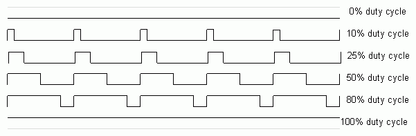

# PWM

## PWM (Pulse Width Modulation) Nedir?

PWM (Pulse Width Modulation / Darbe Genişlik Modülasyonu) geliştirme kartlarında sıklıkla kullanılan bir yöntemdir. Dijital bir pini analog çıkış olarak kullanabilmemizi sağlayan bir yöntemdir. 

Dijital bir pin sadece maximum ve minimum (mahirkart için 3.3V ve 0V) değerlerini alabilir. PWM yöntemi ile bu değerler arasında istediğimiz değerleri alabiliriz.


<!-- Resmi Tekrar oluştur -->


PWM dijital bir pini analog çıkış gibi kullanmak dışında PWM ilgisi ile çalışan bazı cihazları kontrol etmek için de kullanılır. Örneğin servo motorlar PWM ile kontrol edilebilir.

## MahirKart ile PWM

MahirKart'ın bütün dijital pinlerini PWM olarak kullanabilirsiniz. Dijital pinleri [Pinout](../../pinout.md) sayfasından öğrenebilirsiniz.

## Python ile PWM Kullanımı örneği


Bu örneğimizde 25. pine bağladığımız ledi PWM ile yakacağız.

``` python
import machine
import time

led = machine.PWM(machine.Pin(25)) # 25. pine bağlı ledi PWM olarak kullanacağımızı belirtiyoruz.

while True:
    for i in range(0, 65535, 1024): 
        led.duty_u16(i) # 0 ile 65535 arasında değerler alabilen ledi 0 ile 65535 arasında 1024 arttırarak yakıyoruz.
        time.sleep(0.01)
    for i in range(65535, 0, -1024):
        led.duty_u16(i) 
        time.sleep(0.01)

```

## Sonuç

Bu örneğimizde 25. pine bağladığımız ledi PWM ile yakmayı öğrendik. Eğer aklınızda kalan sorular varsa [Discord](https://discord.com/invite/YVc68SrGJK) sunucumuz üzerinden sorabilirsiniz.